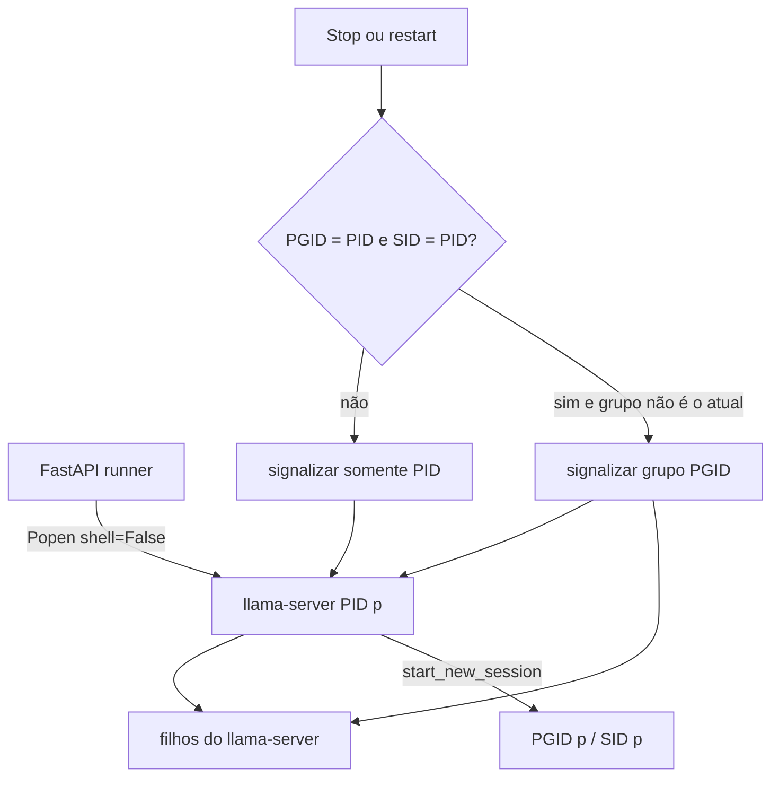

# Arquitetura

## Visão geral

O runtime web tem duas partes no mesmo processo de aplicação: o bundle
React/Vite é servido como arquivo estático pelo FastAPI, e o FastAPI expõe a
API REST/SSE que controla modelos, configurações, telemetria e launches. O
`llama-server` é um processo filho separado, construído a partir de um comando
gerado pelo builder e executado com backend HIP no dispositivo AMD.

Em produção, `window.location.origin` é a base da API; não há base fixa
embutida no bundle. Em desenvolvimento, o Vite pode usar proxy para o backend.
As rotas de launch produzem eventos SSE para a UI. O frontend também consulta
`/api/system` periodicamente e `/api/gpu` na página AMD.

## Inicialização e rotas principais

`app/api/server.py` cria a aplicação FastAPI e, no lifespan, chama
`running.reconcile()` para verificar launches sobreviventes de uma sessão
Python anterior. Se `app/dist/` existir, o FastAPI monta os arquivos estáticos
depois das rotas `/api`.

O fluxo de um launch único é:

1. A UI envia uma `LaunchConfig` para `POST /api/launch`.
2. O backend valida modelo/mmproj contra as raízes cadastradas e salva a
   configuração.
3. `builder.build_command_from_cfg()` resolve o backend, flags, host e porta.
   O backend `mtp` resolve para o mesmo binário do `vanilla`; a diferença é o
   perfil de flags.
4. `runner.run_server_resiliently()` faz o preflight, cria o processo isolado,
   acompanha stdout e inicia o probe de `/health`.
5. Quando `/health` responde HTTP 200 com JSON `{"status":"ok"}`, a UI recebe
   `load_ok`. Uma falha posterior pode ser classificada e passar pela escada de
   auto-degrade, exceto em modo `llama_auto`, modelo corrompido ou mmproj
   incompatível.
6. O stop chama `LaunchHandle.cancel()`, que delega a `running.kill_pid_tree()`.

Há no máximo um launch ativo normal/router porque a porta do servidor é única e
dois modelos concorrentes tornariam OOM e ownership ambíguos. O router é uma
variante: o backend gera um preset INI e um `llama-server` gerencia vários
modelos do mesmo binário.

## Processo, PGID e SID

Em POSIX, o runner passa `start_new_session=True` a `subprocess.Popen`. O
processo filho começa uma nova sessão e, na prática do launch validado, seu PID
é também o PGID e o SID. Assim, o stop pode sinalizar o grupo do servidor sem
atingir o processo FastAPI ou o grupo do shell que iniciou a aplicação.

As invariantes de segurança do kill em `running.py` são:

- nunca usar PID `<= 1`;
- consultar PGID, SID e o grupo atual;
- usar `killpg()` somente quando `pgid == pid`, `sid == pid` e o grupo não é o
  grupo atual;
- cair para sinalização do PID solicitado se a condição não for satisfeita;
- no boot, confirmar liveness e que o processo ainda parece ser
  `llama-server`, evitando reanexar um PID reciclado.

O registry `app/api/api_running.json` guarda `launch_id`, PID, configuração e
timestamp. Ele é estado runtime, não documentação. A reanexação permite que a
UI volte a oferecer Stop após reinício do processo Python; não reconstrói um
loop de auto-degrade que não esteja mais vivo.

## Execução do comando e readiness

O builder monta uma string para exibição e uso interno, mas o runner a separa
com `shlex.split()` e chama `Popen(..., shell=False)`. Caminhos com aspas ou
caracteres de controle são rejeitados pelo builder. O ambiente é copiado por
`amd.hip_env()`, portanto `HIP_VISIBLE_DEVICES` não é reordenado nem sobrescrito
pelo launcher.

Antes do spawn, `_preflight_port()` tenta reservar a porta do comando em
`0.0.0.0`. Se a reserva falhar, o launch termina com `port_occupied` sem criar
um processo ambíguo. Depois do spawn, `_HealthProbe` consulta
`http://<host>:8421/health` sem proxy, trata HTTP 503 como carregamento e só
marca readiness para HTTP 200 cujo JSON contenha `status == "ok"`. Ler uma
linha de stdout não substitui esse contrato.

## Telemetria AMD via sysfs

O contrato corrente é a [ADR 0009 — Paridade de telemetria AMD via
sysfs](adr/0009-paridade-de-telemetria-amd-via-sysfs.md). Em cada chamada,
`app/api/core/amd.py` enumera `/sys/class/drm/card*/device` novamente e aceita
somente cards AMD com vendor `0x1002` e `mem_info_vram_total` inteiro positivo;
cards inválidos são isolados. O código dessa validação e do uso opcional de
`mem_info_vram_used` está em
[`app/api/core/amd.py:L193-L214`](../app/api/core/amd.py#L193-L214).

Os agregados do envelope são `available`, `gpu_count`,
`vram_total_mib`, `vram_used_mib` e `vram_free_mib`; quando há cards válidos,
há também `gpus` e `host_temp_c`, e quando não há cards a resposta inclui
`error`. Se qualquer uso de VRAM faltar, total permanece disponível e uso/livre
ficam `null`. A soma e a conversão byte-para-MiB estão em
[`app/api/core/amd.py:L217-L225`](../app/api/core/amd.py#L217-L225) e o envelope
em [`app/api/core/amd.py:L298-L320`](../app/api/core/amd.py#L298-L320).

Cada item de `gpus` contém `name`, `vendor`, `memory.total`, `memory.used`,
`memory.free`, `temperature.gpu`, `temperature.memory`,
`temperature.hotspot`, `temperature.gpu.limit`, `temperature.gpu.tlimit`,
`fan.speed`, `utilization.gpu`, `utilization.memory`, `power.draw`,
`power.limit`, `clocks.sm`, `clocks.mem` e `driver_version`. Temperaturas vêm
de labels hwmon; fan, utilização, power e clocks vêm dos arquivos sysfs/hwmon
correspondentes; driver vem do módulo amdgpu com fallback do kernel. Todos os
campos de sensor por GPU preservam `N/A` quando ausentes, enquanto
`host_temp_c` preserva `null`. O mapeamento executável está em
[`app/api/core/amd.py:L253-L295`](../app/api/core/amd.py#L253-L295), e o formato
frontend em [`app/src/api/types.ts:L313-L355`](../app/src/api/types.ts#L313-L355).

`GET /api/gpu` é a rota FastAPI que expõe esse contrato
([`app/api/server.py:L310-L312`](../app/api/server.py#L310-L312)). A página AMD
faz polling imediato e, com a opção ligada, repete a cada 2 segundos. O
frontend mantém localmente no máximo 60 pontos de histórico, somente para VRAM
e RAM; não há backend de séries temporais. Isso está em
[`app/src/components/AmdPage.tsx:L92-L178`](../app/src/components/AmdPage.tsx#L92-L178)
e [`app/src/components/AmdPage.tsx:L290-L320`](../app/src/components/AmdPage.tsx#L290-L320).

Essa enumeração e a agregação são compatíveis com múltiplas GPUs em nível de
dados, mas a soma não demonstra distribuição real de pesos, KV ou compute. A
evidência capturada mostra uma única GPU AMD (`gpu_count=1`) em
evidência registrada no repositório privado (logs/final/2.log:L41-L46); os testes de dois cards
em [`app/api/tests/test_amd.py:L19-L36`](../app/api/tests/test_amd.py#L19-L36)
não substituem validação física multi-GPU. A política de coerência, incluindo
tolerâncias dinâmicas entre leituras consecutivas, está descrita na
[ADR 0009](adr/0009-paridade-de-telemetria-amd-via-sysfs.md).

## Construção HIP e GPU

O build histórico validado em `vendor/llama.cpp` usou `GGML_HIP=ON` e
`GPU_TARGETS=gfx1100`. O host tinha ROCm/HIP funcional, com `hipcc` e
`hipconfig`; uma correção de configuração apontou o compilador para os headers
GCC 11 via `--gcc-install-dir`. A Fase 4 confirmou uma inferência na RX 7900
XTX, health HTTP 200 e offload de 29/29 camadas no modelo pequeno de validação.

Esses fatos são evidência histórica daquele host e daquele commit do llama.cpp,
não uma afirmação de compatibilidade para qualquer GPU AMD ou qualquer versão
ROCm. O caminho padrão dos binários é
`vendor/llama.cpp/build/bin/`; Settings e
`LLM_LAUNCHER_LLAMA_CPP_BIN` podem substituí-lo.

## Limites da arquitetura

- A estimativa de memória em `estimator.py` é um modelo aproximado e deve ser
  confrontada com o runtime.
- A agregação multi-GPU da telemetria não substitui uma validação de split do
  llama.cpp.
- O host/porta são configuração confiável do processo, não entrada do
  navegador. O padrão seguro é loopback; publicar em Tailscale requer opt-in.
- MCP não participa da arquitetura padrão: suas rotas são removidas quando a
  feature não está explicitamente habilitada.
